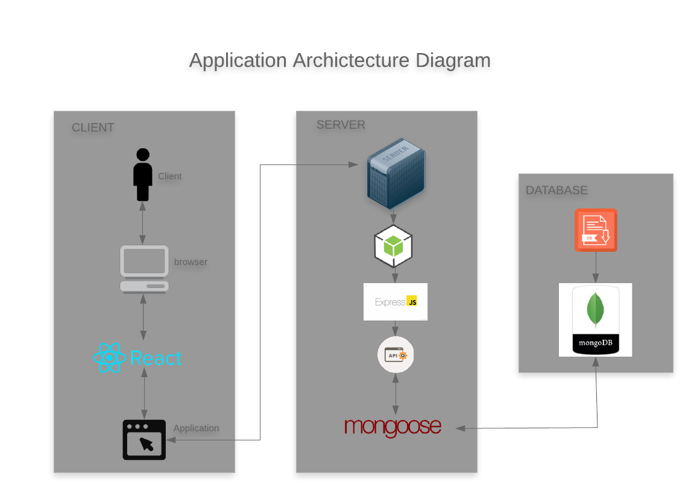
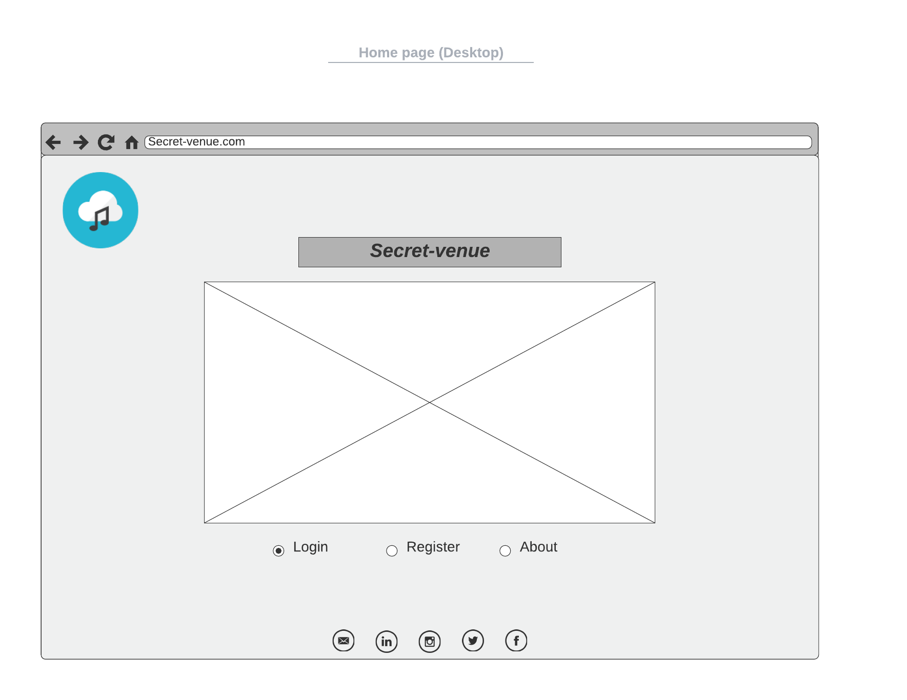
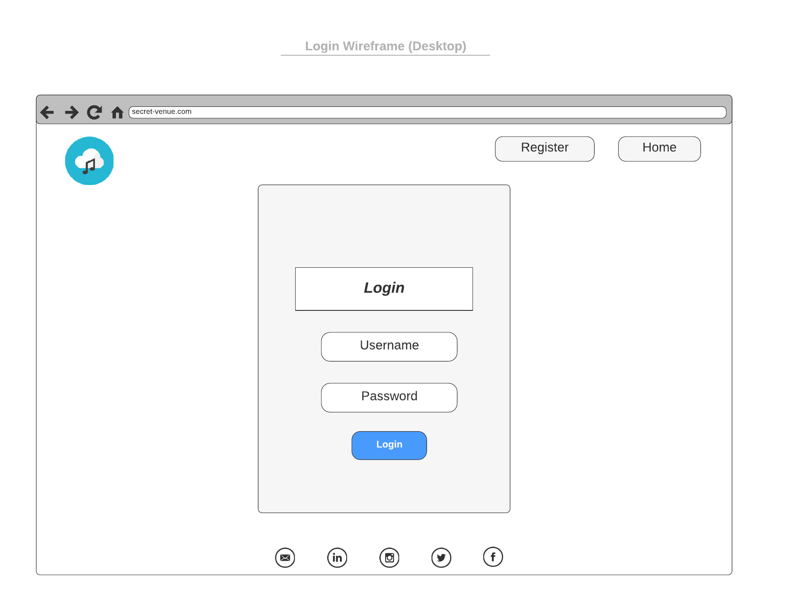
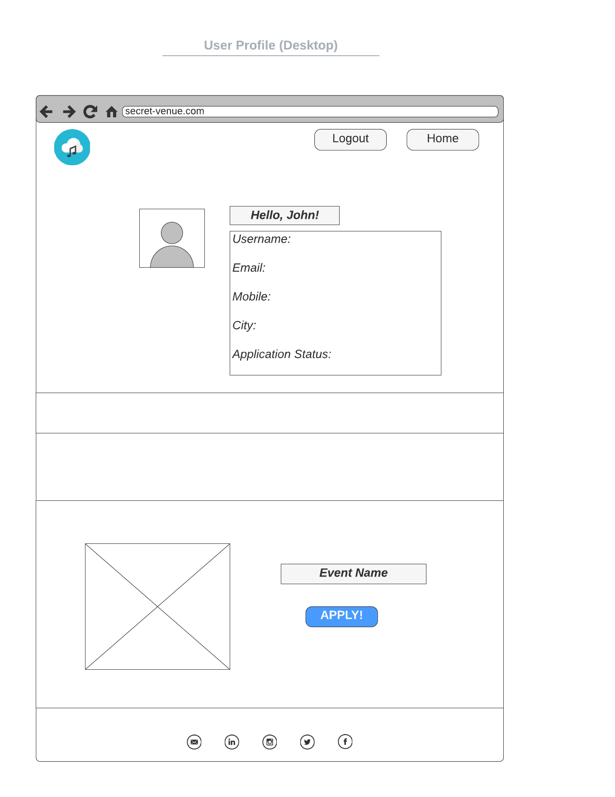
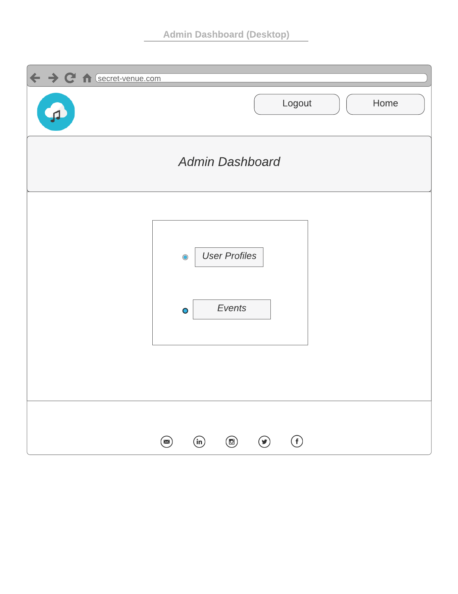
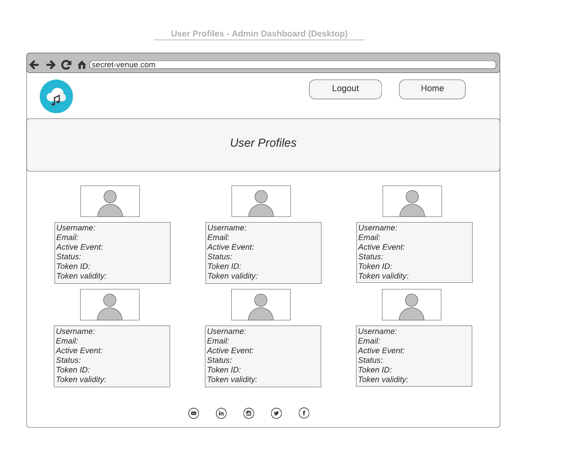
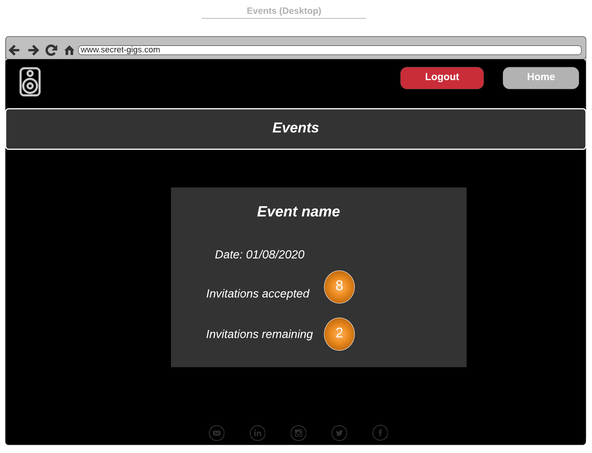
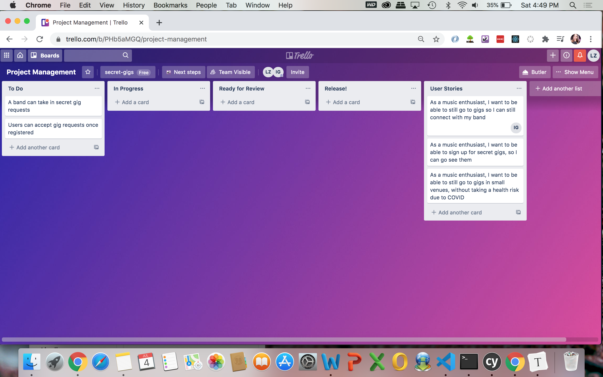
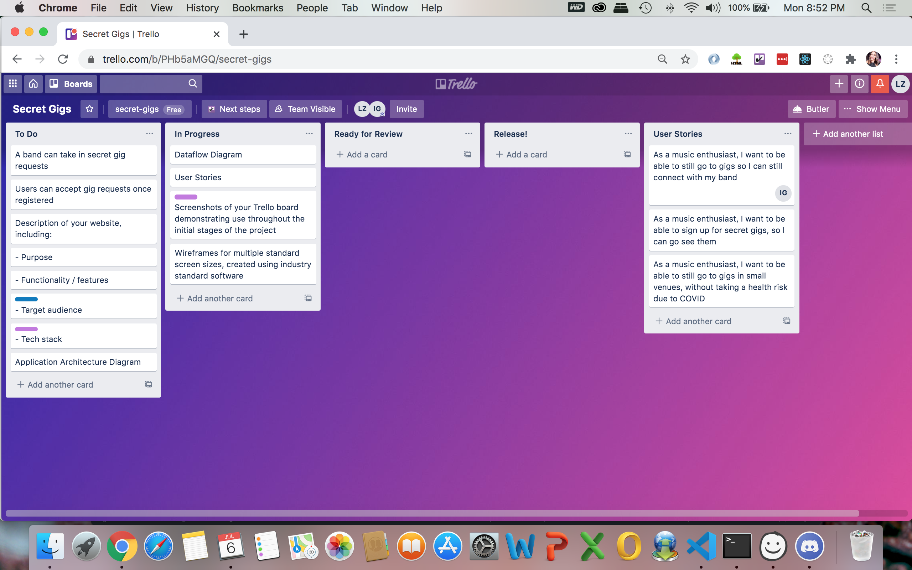
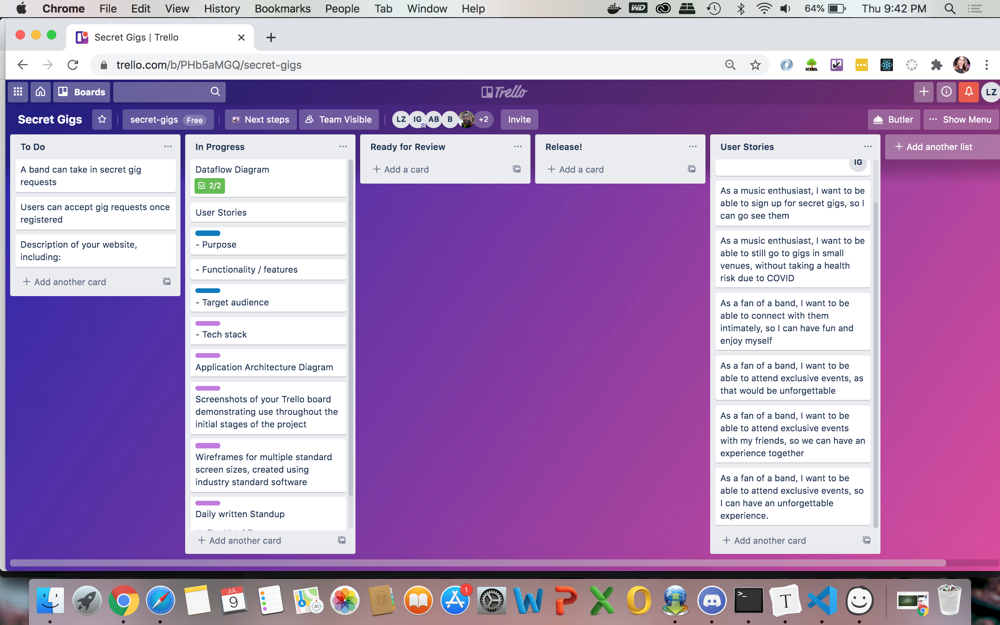

# Secret Gigs Full Stack App

## Contributors
Ignacio Giadach | https://github.com/igscl/

Luisa Ziccarelli | https://github.com/luisaziccarelli

## Purpose
Secret Gigs allows bands to connect with their fan-base in a live setting during COVID times. Due to audience restrictions and venues being generally closed, this app allows fans to attend events in secret locations for a limited number of attendees by a random selection process. The idea is to keep the social distancing and safety measures in place, while allowing safe and controlled events.

## Functionality

## Features
- A User can Register in the application. 
- A registered user is able to Login.
- A registered user will be able to go to his/her account section. In this section they will see Profile and Event Applications, listing current available events they can apply to.
- A registered user has the ability to apply to events.
- A registered user has the ability to edit and delete their profile.
- A registered user has the bility to get an application accepted or denied.

Sprinkles:
- A registered user can go into payment page when application is accepted/
- A registered user once pays for the application, gets the details of the gig sent. 
- An admin has the ability to login to an admin account.
- An admin has the ability to see all user profiles.
- An admin has the ability to see Open events and Closed events.
- An admin has the ability to see the number of invitations accepted and remaining for an open/closed event. 

## Target audience
Specific bands fan-base, music, concert and live music enthusiasts that haven't attended any live gigs due to current events. This also works under "normal" conditions, having the ability to increase the attendees per venue as needed. Specific audiences would relate to the type of music, genre, year, etc.

## Tech stack
- ​	Front-end
  - React.js: a front end JavaScript library for creating user interfaces. React will allow to control the behaviour of user interactions with our application. Through buttons and forms the user will be able to interact with the application, each action resulting in sending a query to the node.js server. React allows us to customize components using a combination of HTML, CSS and JS. 
- Back-end
  - Node.js: a JavaScript runtime that operates on Chrome’s V8 JavaScript engine and brings JavaScript to the server. In this application our node.js server will connect with the database through mongoose, which is a Mongo DB object modeling tool designed to work in an asynchronous environment. 
  - Express: a minimalist web framework for Node.js known for its speed. Express will be used in this application to write handlers for requests with different HTTP verbs at different URL paths (routes). Also express middleware will allow to add support for cookies, sessions, and users. 
  - MongoDB: an open-source, document-based database. For this application mongoDB will store data about users such as: user profiles, events they have applied for, and the status of their application. It will also store data about the events, open and closed, as well as invitations accepted and remaining for each. The data stored in the mongoDB database will be sent back to the node server, which will then send the details to the  front-end and update them.
- Deployment
  - Netlify: a cloud platform used for hosting the front-end of the application. 
  - Heroku: a cloud platform used for hosting the back-end the application.

## Dataflow Diagram

## Application Architecture Diagram

## User Stories

## Wireframes

 

## Trello Screenshots

