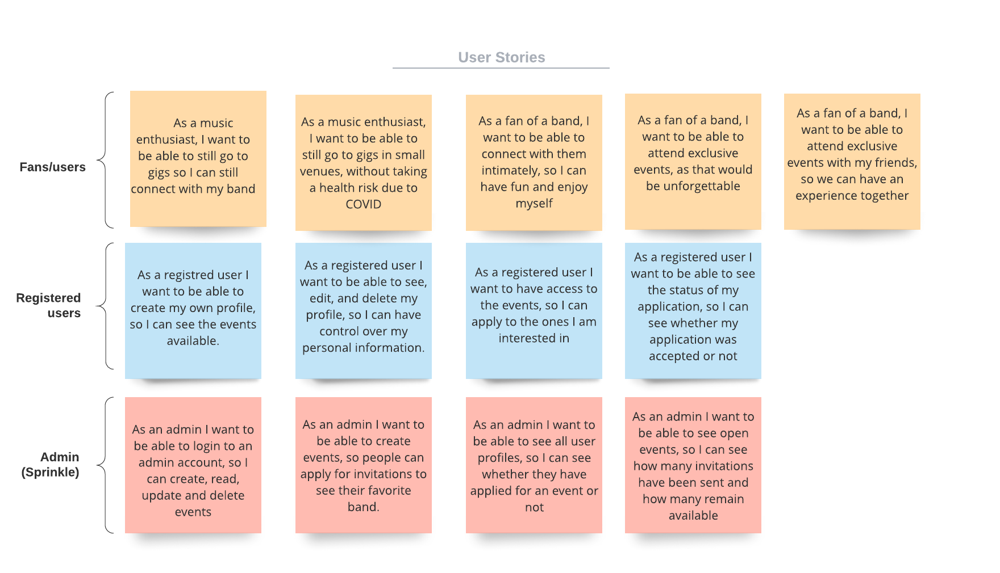

# Secret Gigs Full Stack App

## Contributors
Ignacio Giadach | https://github.com/igscl/

Luisa Ziccarelli | https://github.com/luisaziccarelli

## Purpose
Secret Gigs allows bands to connect with their fan-base in a live setting during COVID times. Due to audience restrictions and venues being generally closed, this app allows fans to attend events in secret locations for a limited number of attendees by a random selection process. The idea is to keep the social distancing and safety measures in place, while allowing safe and controlled events.

## Features

- A user can register in the application. 
- A registered user is able to login.
- A registered user is able to go to the account section. In this section they can see their profile and event applications, listing current available events they can apply to.
- A registered user has the ability to apply to events.
- A registered user has the ability to edit and delete their profile.
- A registered user has the ability to get an application accepted or denied.

Sprinkles:
- A registered user can go into payment page when application is accepted.
- Once a registered user pays for the application, is able to see further details of the gig.
- An admin has the ability to login to an admin account.
- An admin has the ability to see all user profiles.
- An admin has the ability to see Open events and Closed events.
- An admin has the ability to see the number of invitations accepted and remaining for an open/closed event. 

## Target audience
Specific bands fan-base, music, concert and live music enthusiasts that haven't attended any live gigs due to current events. This also works under "normal" conditions, having the ability to increase the attendees per venue as needed. Specific audiences would relate to the type of music, genre, year, etc.

## Tech stack
- ​	Front-end
  - React.js: creates and manages the front-end of the application. 
  - JS: react uses javascript and more specifically ES6 standard features. Javascript will also be used to build the back-end of this application.
  - JSX: stands for JavaScript XML, which allows to write HTML in react.
  - HTML 5: HTML tags will be used inside JS code and transformed into react components by JSX.
  - CSS 3: will be used to style the react components.
  - Bootstrap: framework used for building response websites.

- Back-end
  - Node.js: server side run time. 
  - Express: web framework for node that will handle the http requests from the front end. 
  - MongoDB: document-based database used to store persistent state and data relevant to the users and events. 
  - Mongoose: is a Mongo DB object modeling tool that allows to communicate with the MongoDB through the MongoDB driver.
  - Passport.js: is authentication middleware for Node.js to handle the users and admins.

- Testing
  - Mocha: test framework for node.js used for unit and integration testing.
  - Expect: assertion style or library chosen for unit testing.
  - Cypress: testing framworkd running on and in the browser chosen for testing of the front-end and integration testing.
  
- Deployment
  - Netlify: a cloud platform used for hosting the front-end of the application. 
  - Heroku: a cloud platform used for hosting the back-end the application.
  - MongoDB Atlas: global cloud database to deploy and scale our MongoDB. 

- Source control 
  - Git: version control system used to manage and keep track of the source code history. 
  - GitFlow: the'Forking workflow' was used for this application, which allowed each contributor to have their own server-side repository, for each contributor to take turns manage the push to the official repository, and lastly the use of feature branches.
  - Github: cloud-based hosting service to manage the git repositories for the application. 
 

## Dataflow Diagram

## Application Architecture Diagram

## User Stories

## Wireframes

### Desktop

 

### Ipad

### Mobile 

## Trello Screenshots

#### 1

#### 2

#### 3

#### 4

#### 5

#### 5

