# Secret Gigs - Full Stack App

## Contributors

Ignacio Giadach | https://github.com/igscl/

Luisa Ziccarelli | https://github.com/luisaziccarelli

## 1. Description of the website 

### 1.1 Purpose 

##### 1.1.1 What is the problem this application is trying to solve?

How cool would it be to watch your favourite artists in a live setting with as many people as you could fit in your living room? How about watching your favourite artist in a small bar with your best friends? Have you been craving for a live show, but want to keep with the safety measures in place due to Coronavirus? We're here for you!

And if you're a band... Want to manage cool and safe events for your fans? We've got you covered! You can run this app on your own website!

##### 1.1.2 How is this application solving the problem?

Secret Gigs is an application that allows bands to connect with their fan-base in a live setting (and also during COVID times!). This app allows fans to attend events in secret locations for a limited number of attendees by a random selection process. The idea is to keep the social distancing and safety measures in place, while also allowing safe and controlled events, so bands and fans are safe! This way, bands can continue to perform and fans can enjoy the experience of watching their favourite bands live again... even better than that, in an intimate setting!

### 1.2 Functionality 

Secret gigs allow fans or music enthusiasts to register on the website to be able to apply for open events. Once a user registers, they can see the name of the event, the general location, and capacity. If a user applies they are notified whether their application has been approved or rejected. Since the capacity of the events is limited, the access is managed by either random selection or a first-come-first-serve basis. 

Once the capacity for that particular event is reached, the user will be notified of the specific location, and the 'secret' location will be revealed to the accepted user once payment is made.

### 1.3 Features

Main features:

- A user can register in the application. 
- A registered user is able to login.
- Registered users are able to go to the account section, see their profile and event applications with a list of current available events they can apply to.
- A registered user has the ability to apply to events.
- A registered user has the ability to edit and delete their profile.
- A registered user has the ability to get an application accepted or denied by random selection.

Sprinkles:
- A registered user can go into payment page when application is accepted.
- Once a registered user pays for the application, is able to see further details of the gig.
- An admin has the ability to login to an admin account.
- An admin has the ability to see all user profiles.
- An admin has the ability to see open events and closed events.
- An admin has the ability to see the number of invitations accepted and remaining for an open/closed event. 

### 1.4 Target audience
Specific bands fan-base, music, concert and live music enthusiasts that haven't attended any live gigs due to current events. This also works under "normal" conditions, having the ability to increase the attendees per venue as needed. Specific audiences would relate to the type of music, genre, year, etc.

Also bands that want to connect with their fan-base organising safe, cool, memorable and controlled events. The selection process is seamless and you can distribute invitations in a fair way.

### 1.5 Tech stack
- ​	Front-end
  - React.js: creates and manages the front-end of the application. 
  - JS: react uses javascript and more specifically ES6 standard features. Javascript will also be used to build the back-end of this application.
  - JSX: stands for JavaScript XML, which allows to write HTML in react.
  - HTML 5: HTML tags will be used inside JS code and transformed into react components by JSX.
  - CSS 3: will be used to style the react components.
  - Bootstrap: framework used for building response websites.

- Back-end
  - Node.js: server side run time. 
  - Express: web framework for node that will handle the http requests from the front end. 
  - MongoDB: document-based database used to store persistent state and data relevant to the users and events. 
  - Mongoose: is a Mongo DB object modeling tool that allows to communicate with the MongoDB through the MongoDB driver.
  - Passport.js: is authentication middleware for Node.js to handle the users and admins.

- Testing
  - Mocha: test framework for node.js used for unit and integration testing.
  - Expect: assertion style or library chosen for unit testing.
  - Cypress: testing framework running on and in the browser chosen for testing of the front-end and integration testing.
  
- Deployment
  - Netlify: a cloud platform used for hosting the front-end of the application. 
  - Heroku: a cloud platform used for hosting the back-end the application.
  - MongoDB Atlas: global cloud database to deploy and scale our MongoDB. 

- Source control 
  - Git: version control system used to manage and keep track of the source code history. 
  - GitFlow: the 'Forking workflow' was used for this application, which allowed each contributor to have their own server-side repository, for each contributor to take turns manage the push to the official repository, and lastly the use of feature branches.
  - Github: cloud-based hosting service to manage the git repositories for the application. 

## 2. Dataflow Diagram

## 3. Application Architecture Diagram

## 4. User Stories

## 5. Wireframes

### 5.1 Desktop
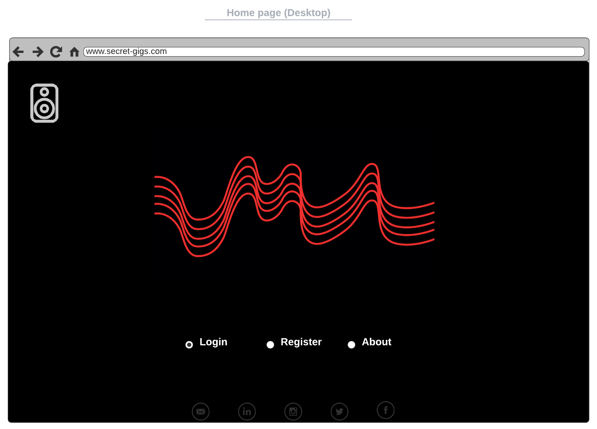
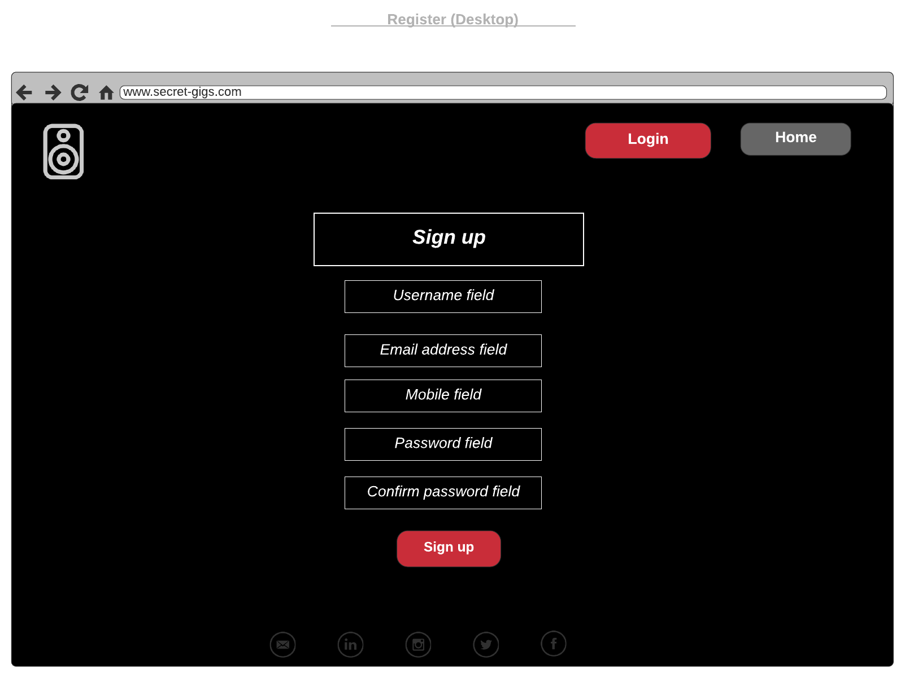
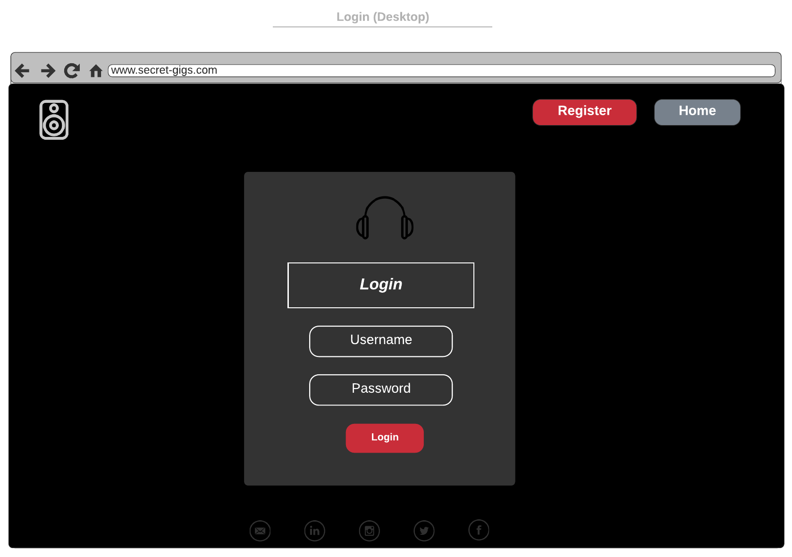
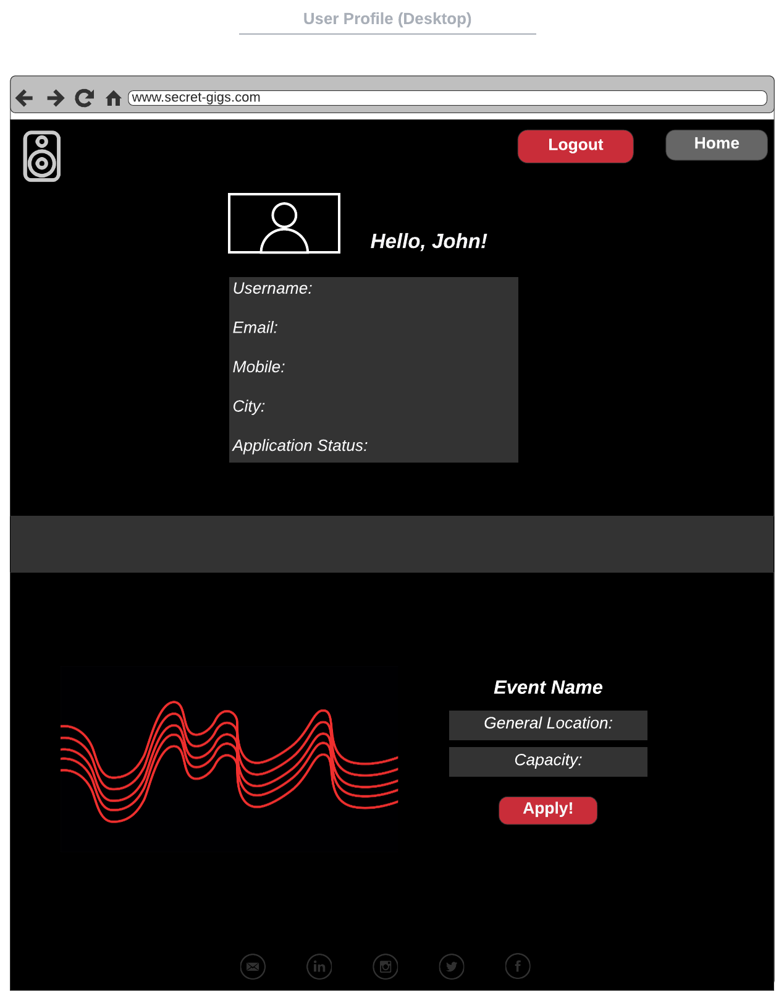
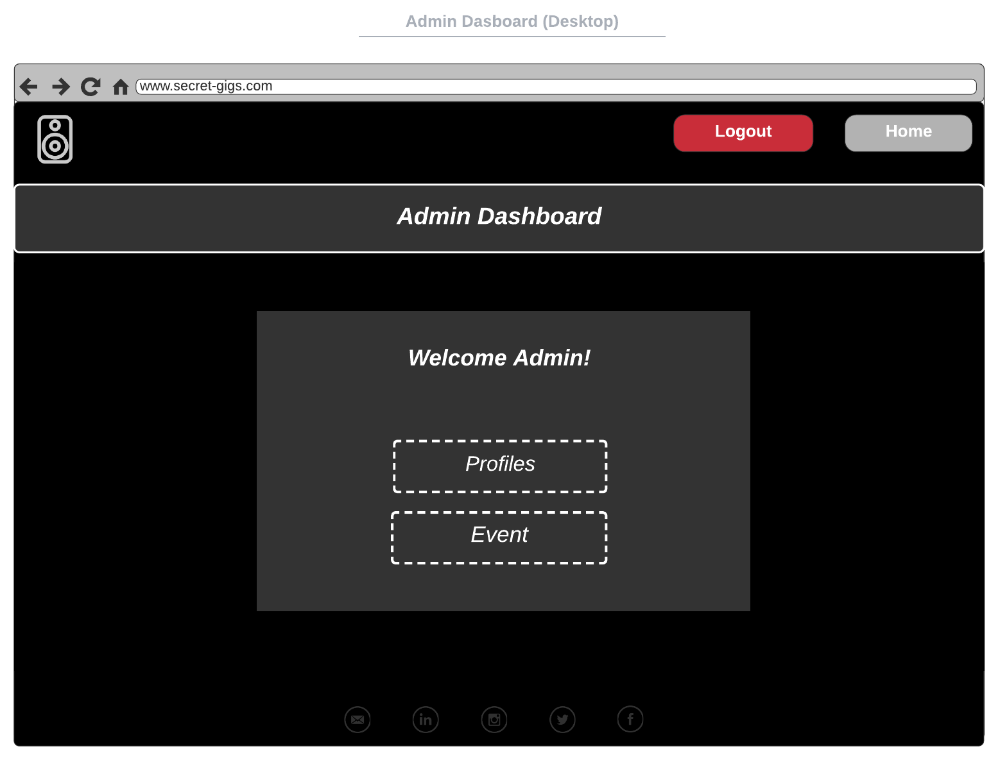 
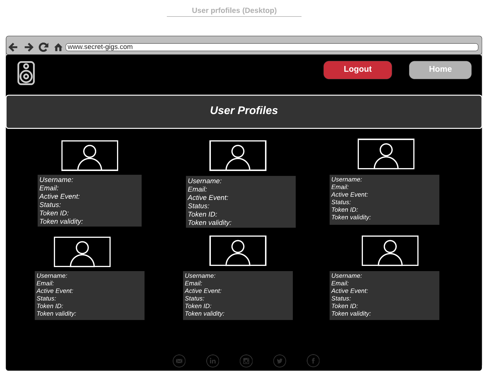

### 5.2 Ipad

### 5.3 Mobile 

## 6. Project Management

#### 6.1 Trello Screenshots (06-07-2020)
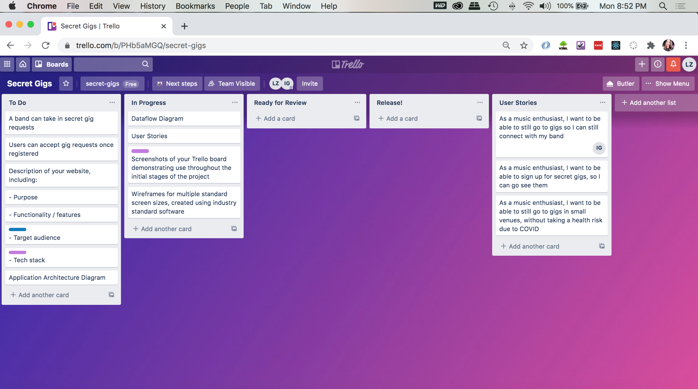
#### 6. 2 Trello Screenshots (08-07-2020)
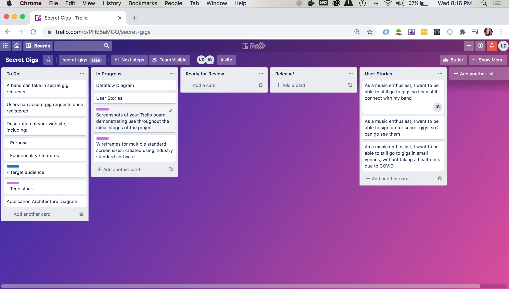
#### 6. 3 Trello Screenshots (09-07-2020)

#### 6. 4 Trello Screenshots (10-07-2020)
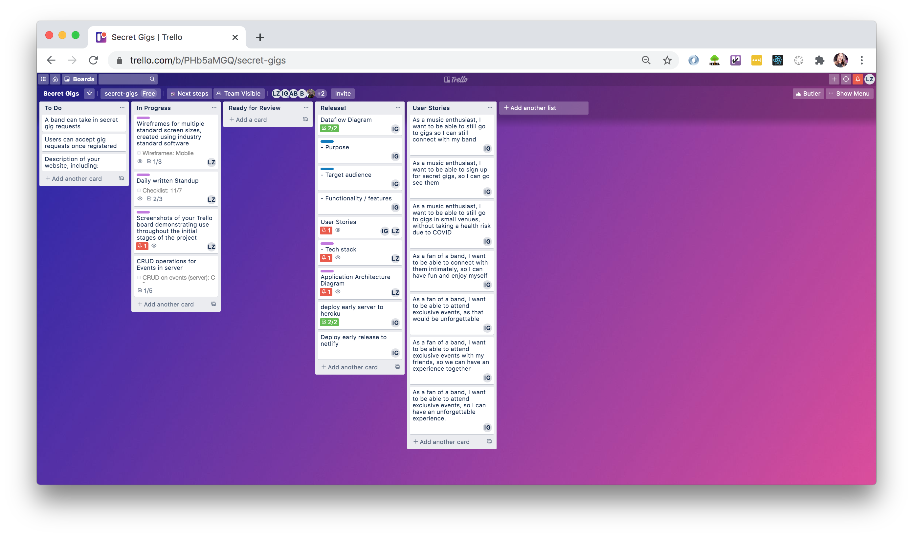
#### 6.5 Trello Screenshots (11-07-2020)
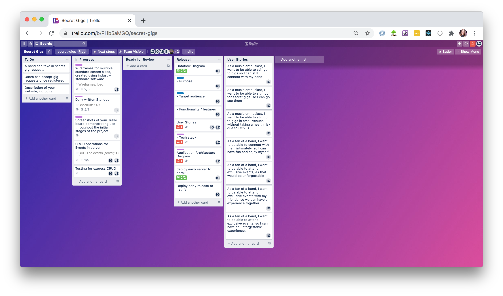
#### 6.6 Trello Screenshots (13-07-2020)
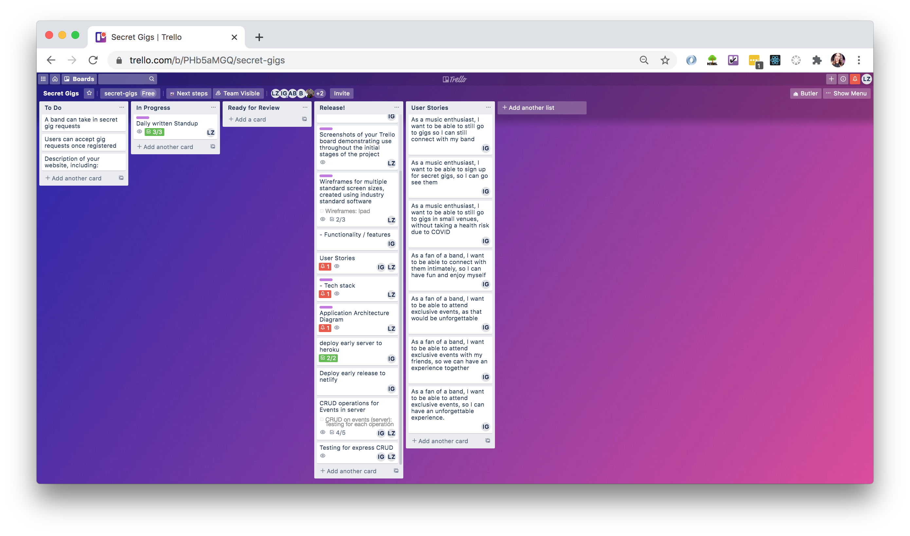 
